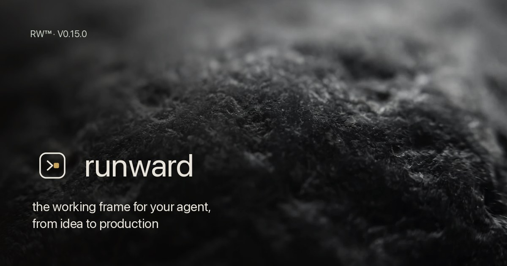

# Runward



[](https://www.npmjs.com/package/runward) [](LICENSE) [](https://github.com/stranxik/designing-and-running-agentic-systems) [](https://ko-fi.com/stranxik)

**After the spec, the hard part starts. Runward ships it and runs it.**

*Run-grade engineering for agentic systems — from business need to a system that holds in production.*

Your agent builds fast. Runward frames what it builds — six gated phases your agent executes and one human signs off — so what ships actually holds.

Runward is a delivery framework for agentic systems. It covers the entire mission, from framing to handover — it opens before any spec in greenfield, or picks up where the spec tools stop, and carries through to the run and the handover either way. Three ways in: day one of a new project (Frame is the first gate, before any spec exists), from an existing spec (Spec Kit, OpenSpec or in-house — it becomes the input of framing), or from an existing prototype (brownfield: characterize before touching anything). Then: floor first (the floor: the smallest *running* system that proves value on real traffic), evolution on evidence, governance from day zero, and a handover that makes your team autonomous.

> Spec Kit, OpenSpec and BMAD take you to tested, sometimes merged code. Runward pilots the whole mission — and picks up their output if you use them. What none of them *structures* is the run: governed memory, resilience, execution security, continuous evaluation, transmission.

## Why

Nearly everything that calls itself agentic today dies somewhere between the demo and production. Not because the model is weak, but because nobody can evaluate a non-deterministic behavior, govern it, or say in advance when it fails. These are architecture problems, not model problems. The industry's own signal is unambiguous: model vendors now deploy engineers directly into client organizations, because the bottleneck has moved from the model to its integration into the real world.

Spec-driven frameworks answered the first half of that problem: write the right thing. Nobody structured the second half: ship it, run it, hand it over. That is why Runward exists.

Agentic systems break four assumptions of classical distributed engineering. The core component is **non-deterministic**: same input, different output, by design. **Input is indistinguishable from instruction**: anything the model reads can try to command it, so prompt injection is structural, not a bug to patch. **Forgetting becomes an engineering problem**: memory that only grows drowns the signal, so decay, invalidation and consolidation have to be designed, not hoped for. And the **blast radius is unprecedented**: an agent with tools acts on the world, so a bad output is no longer just a bad answer.

Runward's answer opens with a founding inversion — the **LLM Boundary Principle**: the architecture constrains the model, never the other way around. That opening posture unfolds into five gestures: boundaries before the stack; start simple, isolate by contract, grow on evidence; keep the deterministic out of the model; explicit state and governed memory; govern, trace and evaluate from day zero. The full base is the method itself: six gated phases (a gate: a checkpoint you cross on evidence, never on assertion), each with a Definition of Ready and a Definition of Done, a 22-arbitration decision matrix, and 54 craft rules. The inversion opens the method; the phases, gestures and rules are what carry it.

## Who it's for — and when

Three profiles, three doors into the same method:

| You are | Where you enter |
|---|---|
| **A tech lead with a working prototype** that must now hold production | The brownfield workflow: characterize the existing system before touching anything |
| **An operator or consultant delivering an agentic system for a client**, especially in a regulated sector | Frame: day one is a conversation with your sponsor, not code |
| **A team finishing a spec** with Spec Kit, OpenSpec or BMAD | Your spec becomes the input of framing; the gates continue from there |

**When NOT to use it.** An already-specified tooling request with no production stakes. Recurring operations — Runward hands over, it does not operate. A pure content or assistant use case, with no tools and no blast radius. And if you want a framework that decides for you: Runward makes *you* decide, at every gate.

**Monday morning.** Install, run `runward init`, and fill `runward/framing.md` with your sponsor — a conversation, not code. Day one produces a framing note and a mission contract. The first code you write is the floor — weeks in, not months.

**The honest timeline** — the one the mission contract states. Framing takes days. An executable floor takes weeks. Iteration is paced by evidence, and handover ends the mission. No dates promised; gates crossed on proof.

The cost is discipline: one accountable operator, governance from day zero, and every structural decision written as an ADR (Architecture Decision Record: a dated, locked decision with a re-evaluation trigger). The longer version — the three entry scenarios told concretely, the anti-cases, what you hold at the end — is in [When to use Runward, and when not to](docs/when-to-use.md).

## Install

```bash
npx runward init                 # interactive wizard
npx runward --yes init           # non-interactive, defaults (CI-friendly)
npx runward init --tools claude,cursor,copilot,gemini,windsurf
```

New here? Follow [your first mission in 15 minutes](docs/first-mission.md).

### Commands

| Command | What it does |
|---|---|
| `runward init` | Scaffold the mission structure (wizard: entry mode, stopping tier, tool profiles) |
| `runward check` | **Gate audit**: which deliverable, expected at which phase, is missing, started, or filled — exit code 1 on gaps |
| `runward check --strict` | **Conformance gate**: verifies each phase's rule-conformance manifest — every CRITICAL/HIGH craft rule mapped to the phase is accounted for (applied with a `file:line`/test, deviated with an ADR, or reasoned `n/a`). **Deterministic and zero-LLM**: it proves a decision was traced, never the code's quality, and cannot be jailbroken by injection — rerun it and get the same verdict |
| `runward status` | Mission snapshot: current gate, decision journal (ADRs), workflows |
| `runward doctor` | Environment and installation checks |
| `runward update` | Refresh `runward/workflows/` from the package — mission state never touched, local edits preserved unless `--force` |
| `runward characterize` | **Read-only inventory** of an existing codebase (brownfield / retro-documentation) → `runward/characterization.md`: dependencies and lockfiles, entrypoints, CI, tests, git-log shape. Deterministic and zero-LLM; it parses artifacts at rest and never runs, builds, or writes to your code. Facts, not decisions — reconstructing the *why* stays yours |
| `runward compliance <regime>` | **Assemble a regime-framed evidence pack** (ISO 42001 today) from the mission's artifacts → `runward/compliance/…`: the OWASP ASI coverage, rule-conformance status and ADR journal as an assessment-readiness *draft*, with the operator-only sections (applicability, risk acceptance, sign-off) explicitly flagged. Deterministic, read-only, zero-LLM — supporting evidence, never a compliance claim |

Global flags: `--yes`, `--dry-run`, `--verbose`, `--no-color`. Exit codes: 0 success, 1 gaps/warnings, 2 missing prerequisite.

The gate's exit code is a **port**: `runward/adapters/` ships inert sample wiring so the gate runs at each harness's natural moment. The git `pre-commit` and CI adapters are **agent-agnostic** — they gate whatever agent produced the code (Codex, Claude, Cursor, Copilot, Gemini); the Claude Code `Stop`-hook is one example of a per-harness turn-end hook, not a privileged one. You copy an adapter in; runward never installs or runs one for you.

`init` creates:

```
your-project/
├── AGENTS.md                    # vendor-neutral agent charter (the "law" file)
├── runward/
│   ├── framing.md               # problem, value, observable success criterion, floor vs target
│   ├── mission-contract.md      # one-page steering contract: engagements, DoD, gates
│   ├── architecture.md          # boundaries, ports, integration protocol — stack stays open
│   ├── decision-matrix.md       # 22 arbitrations: one sober default + one explicit trigger each
│   ├── reference-stack.md       # default adapter kit per layer, with evolution triggers
│   ├── shared-bricks.md         # bricks beyond the app: placement families, brick matrix, sovereignty by data class
│   ├── floor.md                 # the smallest system that proves value on real traffic
│   ├── adr/                     # one ADR per structural decision, with re-evaluation trigger
│   ├── rules/                   # 54 craft rules your agent applies while building
│   ├── governance/
│   │   ├── threat-model.md      # lethal trifecta, 2-of-3 rule on the context window
│   │   ├── evaluation-rubric.md # test the deterministic, evaluate the non-deterministic
│   │   └── observability-schema.md
│   ├── contracts/               # port contracts (versioned, additive, tolerant reader)
│   ├── runbook.md               # recovery runbook for the team that inherits the system
│   ├── adapters/                # inert samples that run the gate at each harness seam (git, CI, Claude Code)
│   └── workflows/               # the method, executable by your agent
└── .claude/ | .cursor/          # tool profiles (--tools)
```

## The method: six phases, gated

Each phase has entry conditions (Definition of Ready) and a Definition of Done. You do not move on assertion; you move on evidence.

| Phase | Output | Done when |
|---|---|---|
| 1. Frame | `framing.md` | Sponsor validates the observable success criterion and the floor scope |
| 2. Architect | `architecture.md` + ADRs | Boundaries decided, stack still open |
| 3. Ship the floor | Running system + `floor.md` | First measured proof against the criterion, on real cases |
| 4. Iterate on evidence | Increments + ADRs | Every addition traced to an objective trigger |
| 5. Govern & evaluate | Threat model, rubric, observability | Instrumented from day zero, never retrofitted |
| 6. Hand over | Handover kit | The team redoes a task autonomously — demonstrated, not declared |

Phase 5 is transverse: it starts at day zero, not after the incident.

## What makes it different

- **The gate you own — deterministic and zero-LLM.** `runward check --strict` is a non-probabilistic, operator-owned exit-code gate: it cannot be jailbroken by injection (no model in the gate path) and reruns byte-for-byte. Every competitor gates on LLM generation plus human prose review; this one does not depend on an LLM to pass.
- **Audit-ready evidence, not compliance theatre.** Craft rules carry an OWASP ASI (Top 10 for Agentic Applications) mapping — a universal, region-agnostic security posture — so the conformance manifest reads as supporting evidence. Security-only by default; it maps to your regime when you need one — ISO/IEC 42001 (global), NIST AI RMF (US), or the EU AI Act art. 13 technical file (EU) — see [`docs/compliance/`](docs/compliance/). An input to that work — never a conformity assessment, never a claim to certify.
- **Never a runtime.** Runward writes nothing into `.git/`, installs nothing, and runs nothing of yours — it frames, gates and hands off. Your runtime and model are swappable adapters behind a port; the thing you depend on is never Runward.
- **Floor, not MVP deck.** The floor is the smallest *running* system that proves value on real traffic. A presentation is not a floor.
- **Evolution on evidence.** Multi-agent, long-term memory, microservices, a bigger model: each has a sober default and an explicit trigger. No trigger, no complexity. Every switch is an ADR.
- **Security by architecture, not detection.** Prompt injection is constrained structurally (lethal trifecta, 2-of-3 rule), not filtered heuristically.
- **Craft rules, not vibes.** 54 engineering craft rules ship with the mission (memory scoring, tiered retrieval, event sourcing, request-id propagation, multi-provider fallback, cost routing, post-turn pipelines, prompt-injection defenses…) — your agent applies them, `runward check` will not invent them. Code examples follow the reference-stack default (a single language in the core — TypeScript by default, an adapter decision like any other: see the decision matrix). The patterns are the contract; the language is the adapter.
- **One accountable operator, not a simulated team.** One human owns every gate while the agent executes the workflows — see [the operator role](docs/operator-role.md).
- **Handover as a deliverable.** The mission ends when the receiving team is autonomous, with proof.

## The reference floor

`floor-ts/` is a clonable scaffold that implements the Runward defaults: hexagonal core, the model behind a port (a port: a stable contract behind which implementations swap — here a deterministic echo adapter by default, zero keys, zero network), provider profiles keyed on base URL, middleware chain (logging, access, cost cap, approval), day-zero cost ceiling, secrets redaction, per-call prompt provenance (a SHA-256 of every prompt), suspend-and-rehydrate on human approval, full test pyramid and an evaluation harness. It is expressed in TypeScript because it implements the reference-stack defaults — one language in the core, and which one is an adapter decision like any other. The durable part is what it demonstrates: the ports, the contracts, the middleware chain, the deterministic guard. Port them to your language and the architecture survives. Its README maps each principle to the exact file that implements it. Start a floor by cloning it, not from a blank page.

## Relationship to the canon

Runward is the tooling of the doctrine **“Designing and Running Agentic Systems”** (Thibault Souris, 2026) — a 60-page architecture reference, published separately under CC BY-ND 4.0 in [its own repository](https://github.com/stranxik/designing-and-running-agentic-systems). The doctrine is the canon: read it for the *why*. Runward is MIT: fork it, adapt it, contribute. See [NOTICE.md](NOTICE.md).

Read the doctrine: [Concevoir et exécuter des systèmes agentiques (FR)](https://github.com/stranxik/designing-and-running-agentic-systems/blob/main/Concevoir-et-executer-des-systemes-agentiques-2026.pdf) · [Designing and Running Agentic Systems (EN)](https://github.com/stranxik/designing-and-running-agentic-systems/blob/main/Designing-and-Running-Agentic-Systems-2026.pdf)

## Supported tools

Tool profiles: **Claude Code** (slash commands `/rw-*`), **Cursor** (rules), **GitHub Copilot** (instructions), **Gemini CLI** (GEMINI.md), **Windsurf** (rules). `AGENTS.md` is always written — it is the vendor-neutral standard read by Codex CLI, opencode, Amp and a growing list of agents, so the method works even without a dedicated profile. The mission structure itself is plain markdown in your repo. More profiles welcome (see [ROADMAP.md](ROADMAP.md)).

## License

MIT © Thibault Souris. The doctrine text is licensed separately (CC BY-ND 4.0) and is **not** included in this repository.
